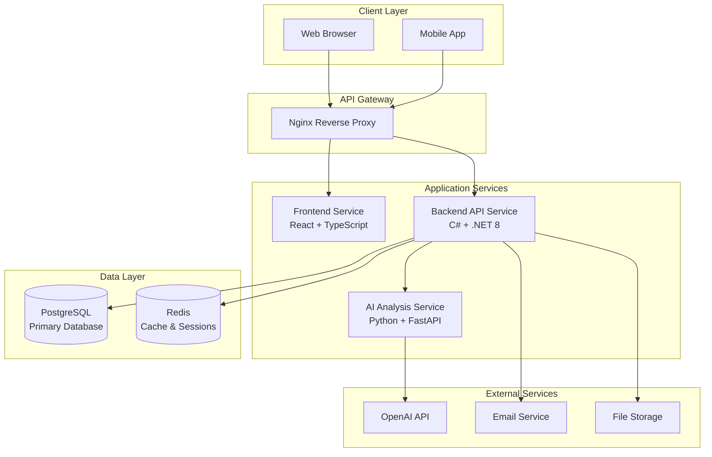
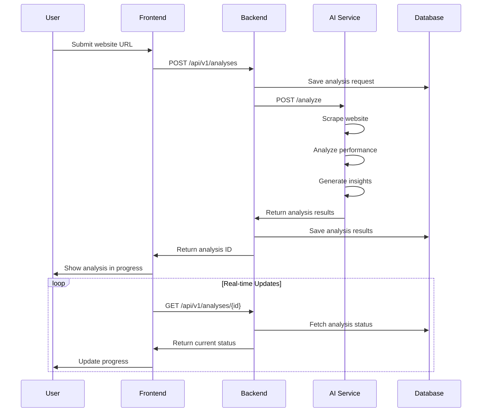

# AICO Architecture Documentation

## Table of Contents
1. [System Overview](#system-overview)
2. [Microservices Architecture](#microservices-architecture)
3. [Service Interactions](#service-interactions)
4. [Data Flow](#data-flow)
5. [Security Architecture](#security-architecture)
6. [Deployment Architecture](#deployment-architecture)
7. [Scalability & Performance](#scalability--performance)
8. [Monitoring & Observability](#monitoring--observability)

## System Overview

AICO is built as a cloud-native microservices application following Domain-Driven Design (DDD) principles and Clean Architecture patterns. The system is designed for high availability, scalability, and maintainability.

### Core Principles
- **Microservices Architecture**: Loosely coupled, independently deployable services
- **Domain-Driven Design**: Business logic organized around domain boundaries
- **Clean Architecture**: Dependency inversion and separation of concerns
- **CQRS Pattern**: Command Query Responsibility Segregation for complex operations
- **Event-Driven Architecture**: Asynchronous communication between services

## Microservices Architecture

### Service Boundaries

### Service Responsibilities

#### Frontend Service
- **Purpose**: User interface and user experience
- **Technology**: React 18 + TypeScript + Vite
- **Responsibilities**:
  - Render user interfaces
  - Handle user interactions
  - Manage client-side state
  - Communicate with backend APIs
  - Implement responsive design

#### Backend API Service
- **Purpose**: Core business logic and data management
- **Technology**: C# + .NET 8 + ASP.NET Core
- **Responsibilities**:
  - User authentication and authorization
  - Business logic implementation
  - Data validation and persistence
  - API endpoint management
  - Integration with external services

#### AI Analysis Service
- **Purpose**: Website analysis and AI-powered insights
- **Technology**: Python + FastAPI
- **Responsibilities**:
  - Website scraping and analysis
  - AI/ML model execution
  - Performance metrics calculation
  - Recommendation generation
  - Computer vision processing

## Service Interactions

### Communication Patterns

#### Synchronous Communication
- **HTTP/REST**: Primary communication protocol
- **Request/Response**: Real-time operations
- **API Contracts**: OpenAPI/Swagger specifications

#### Asynchronous Communication
- **Message Queues**: Background processing
- **Event Streaming**: Real-time updates
- **Webhooks**: External service integration

### API Design

#### RESTful Principles
- **Resource-based URLs**: /api/v1/analyses/{id}
- **HTTP Methods**: GET, POST, PUT, DELETE, PATCH
- **Status Codes**: Proper HTTP status code usage
- **Content Negotiation**: JSON primary, XML support

#### API Versioning
- **URL Versioning**: /api/v1/, /api/v2/
- **Backward Compatibility**: Maintain previous versions
- **Deprecation Strategy**: Gradual phase-out process

## Data Flow

### Request Flow
1. HTTP Request → API Controller
2. Controller → Application Service
3. Application Service → Domain Service (business logic)
4. Domain Service → Repository (data access)
5. Repository → Database
6. Database → Repository (data retrieval)
7. Repository → Domain Service
8. Domain Service → Application Service
9. Application Service → Controller (DTO mapping)
10. Controller → HTTP Response

### Event Processing Flow
1. Event Received → EventController
2. EventController → EventService (Application)
3. EventService → Event.Create() (Domain)
4. Event.Create() → Domain Validation
5. EventService → EventRepository.Add()
6. EventRepository → Database
7. Domain Event → Event Handlers
8. Event Handlers → Analytics Processing
9. Analytics → Recommendation Generation
10. Response → Client

## Security Architecture

### Authentication & Authorization

#### JWT-Based Authentication
- **Token Structure**: Header.Payload.Signature
- **Token Expiry**: 15 minutes access, 7 days refresh
- **Token Storage**: HttpOnly cookies for web, secure storage for mobile

#### Role-Based Access Control (RBAC)
- **User Roles**: Admin, User, Guest
- **Role-Based Permissions**: CRUD operations on analyses

### Data Encryption

#### Data at Rest
- **Encryption**: AES-256
- **Key Management**: AWS KMS

#### Data in Transit
- **HTTPS**: Secure communication
- **TLS**: Transport Layer Security

### Security Measures

#### API Security
- **Rate Limiting**: 100 requests/minute per user
- **CORS Configuration**: Restricted origins
- **Input Validation**: Comprehensive sanitization
- **SQL Injection Prevention**: Parameterized queries
- **XSS Protection**: Content Security Policy

#### Data Protection
- **Encryption at Rest**: AES-256 database encryption
- **Encryption in Transit**: TLS 1.3 for all communications
- **PII Protection**: GDPR compliance measures
- **Audit Logging**: Comprehensive security event logging

## Deployment Architecture

### Environment Strategy

#### Development Environment
- Local Docker Compose setup
- Hot reloading for rapid development
- Local database instances
- Mock external services

#### Staging Environment
- Cloud-based deployment
- Automated CI/CD pipeline
- Test data and configurations
- Integration with test external services

#### Production Environment
- High-availability cloud deployment
- Load balancing and auto-scaling
- Production database with backups
- Monitoring and alerting

### Containerization

#### Docker Containers
- Microservices in separate containers
- Environment-specific configurations
- Resource limits and constraints
- Health checks and graceful shutdown

#### Orchestration
- Docker Compose for development
- Kubernetes for production
- Service discovery and load balancing
- Rolling updates and rollbacks

## Scalability & Performance

### Horizontal Scaling
- Stateless services for easy replication
- Load balancing across instances
- Session affinity when needed
- Database read replicas

### Vertical Scaling
- Resource optimization
- Performance profiling
- Memory and CPU allocation
- Database query optimization

### Caching Strategy
- In-memory caching for frequent queries
- Distributed cache for shared data
- Cache invalidation patterns
- Time-based and event-based expiration

### Performance Optimization
- Database indexing
- Query optimization
- Asynchronous processing
- Batch operations for bulk data

## Monitoring & Observability

### Logging
- Structured logging format
- Centralized log aggregation
- Log levels and filtering
- Correlation IDs for request tracing

### Metrics
- System metrics (CPU, memory, disk)
- Application metrics (requests, errors, latency)
- Business metrics (conversions, users, revenue)
- Custom metrics for specific features

### Alerting
- Threshold-based alerts
- Anomaly detection
- On-call rotation
- Incident response procedures

### Dashboards
- Real-time system overview
- Historical performance trends
- Error rates and patterns
- Business KPIs and metrics